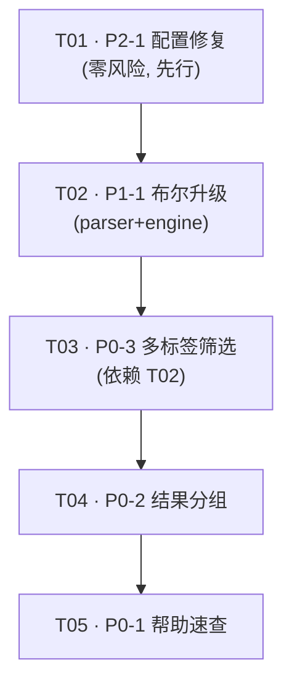

# 增量系统架构设计 + 任务分解 —— article_searcher（PyQt6 本地文章检索桌面应用）

> 架构师：高见远（Bob）
> 范围：本报告对应 PM 许清楚《功能优化与新增建议报告》3.4 / 3.6 节已选定增量
> - P2-1 修 config 设备优先级（一行零风险）
> - P1-1 高级语法补完 AND/OR/NOT + 括号分组（parser + engine 升级）
> - P0-3 左栏多标签组合筛选（依赖 P1-1）
> - P0-2 结果按文件/标签/源聚合分组展示
> - P0-1 应用内帮助 + 高级语法速查浮层
> 约束：**不破坏现有 240 个测试用例**（`tests/run_all.py` 用显式 `CASES` 列表登记）。所有新增字段/参数均向后兼容（带默认值），不修改既有函数签名破坏旧调用。

---

# Part A：系统设计

## 1. 实现方案 + 框架选型

### 1.1 框架选型（确认无新重依赖）
- **沿用 PyQt6**（项目既有 UI 框架，无需新增）。
- **core 层纯 Python**：布尔 AST、分组渲染、配置修复均为纯 Python / PyQt6，不引入新第三方库。
- **确认依赖包为零新增**：仅需确认 `PyQt6` 已在 `requirements.txt` / venv 中（既有依赖），本期不引入任何新包。
- RRF 融合（`core/search.py`）本期**不涉及**改动。

### 1.2 架构模式
保持现有「controller + widget(view) + engine(model)」分层：
- `core/engine.py` = 模型层（检索 + 文件级过滤语义）。
- `ui/*` widget = 视图层（渲染、输入）。
- `ui/main_window.py` = 控制器（编排 worker 线程、连接信号）。

本期增量：
- **P1-1** 在 `engine.search` **内部**新增一条「布尔 AST 求值」分支，对外签名不变；旧「扁平字段」路径 100% 保留，仅当 `parsed.has_boolean=True` 时走新分支。
- **P0-2 / P0-3 / P0-1** 均为视图/控制器层增强，引擎仅被动接收更丰富的 `ParsedQuery`。

### 1.3 核心难点与对策
| 难点 | 对策 |
|---|---|
| 不破坏 240 用例 | ① `parse_query` 签名不变，`ParsedQuery` 仅新增带默认值字段；② `engine.search` 签名不变，旧扁平路径原样保留，新路径仅由 `has_boolean` 门控；③ `display_results` 新增默认参数 `group_mode=FLAT`；④ `TagFilterWidget` 旧信号 `tag_selected` 保留，新增 `tags_selected`。 |
| 布尔检索语义（AND/OR/NOT/括号） | 引入轻量布尔 AST（TagNode/PathNode/TermNode/NotNode/AndNode/OrNode）。文件级（tag/path）精确求并/交/差；检索词（term）采用「正项拼接进检索 + 命中后内容级 AND/OR/NOT 后过滤」（语义模式下为近似，与现有 `-排除词` 的近似排除哲学一致）。 |
| 左栏多选与搜索框语法对齐 | `tag:A tag:B` = 隐式 AND（交集，现状）；`tag:A OR tag:B` = 显式 OR（并集）；`-tag:B` = 差集。左栏多选 + AND/OR 切换 → `build_tag_filter_parsed(tags, op)` 生成与搜索框同构的 `ParsedQuery`。 |
| 结果分组不破坏选中/去重 | 默认 `FLAT` 渲染路径与现状逐行一致；`BY_FILE` 用单条 `QListWidgetItem` 承载文件级卡片（最佳片段 + 可展开 chunk 列表），点击仍发射最佳 chunk 结果，去重键 `_result_key` 沿用。 |

---

## 2. 文件列表（相对项目根 `article_searcher/`）

> 标注：**[新]** = 新增文件；**[改]** = 修改既有文件。

**P2-1（配置修复，独立先行）**
- `core/config.py` **[改]** — `AppConfig.priority` 默认值 `"npu,gpu,cpu"` → `"gpu,cpu"`（第 30 行，一行）。
- `tests/test_config_priority.py` **[新]** — 回归测试：断言 `AppConfig().priority == "gpu,cpu"`。
- `tests/run_all.py` **[改]** — 在 `CASES` 追加 `test_config_priority`（unittest 子进程，`QT_QPA_PLATFORM=offscreen`）。

**P1-1（解析器 + 引擎布尔升级，P0-3 前置）**
- `core/query_parser.py` **[改]** — 新增布尔 AST 节点类、`ParsedQuery.expr` / `has_boolean` 字段、`parse_query` 同步构建 AST、新增 `build_tag_filter_parsed()` 与 `combine_parsed()` 辅助。
- `core/engine.py` **[改]** — `search()` 内部新增 `has_boolean` 门控分支；新增 `_eval_bool_path()` / `_eval_tag_path_expr()` / `_eval_text_bool()`；旧扁平路径（`_resolve_allowed_files` 等）保留。
- `tests/test_boolean_query.py` **[新]** — 布尔解析 + 引擎并/差/分组过滤单测。
- `tests/run_all.py` **[改]** — `CASES` 追加 `test_boolean_query`。

**P0-3（左栏多标签组合筛选，依赖 P1-1）**
- `ui/tag_filter.py` **[改]** — 单选改多选 + AND/OR 切换；信号 `tag_selected(str)` → 新增 `tags_selected(list, op)`（旧信号保留兼容）。
- `ui/main_window.py` **[改]** — 仅改与标签筛选相关区段：连接 `tags_selected`、新增 `_pending_tag_parsed`、改写 `_on_tag_selected(tags, op)`、在 `_perform_search` 中用 `combine_parsed` 合并文本框解析与左栏筛选。
- `tests/test_tag_filter_ui.py` **[新]** — 多选 + AND/OR 组合构造 `ParsedQuery` 的 UI 逻辑单测（用 `_ui_fakes` 风格，offscreen）。
- `tests/run_all.py` **[改]** — `CASES` 追加 `test_tag_filter_ui`。

**P0-2（结果分组渲染）**
- `ui/search_result_list.py` **[改]** — 新增 `GroupMode` 枚举、分组开关控件、`display_results(results, group_mode=FLAT)`、`set_group_mode()`、分组渲染（`FileGroupCard` 等）。`FLAT` 路径与现状一致。
- `ui/main_window.py` **[改]** — 仅改中栏构造区段：加入分组开关并连线到 `result_list.set_group_mode()`；存 `_group_mode`。
- `tests/test_result_grouping.py` **[新]** — 验证 FLAT 行数不变、BY_FILE 折叠为文件数、BY_TAG/BY_SOURCE 分组正确。
- `tests/run_all.py` **[改]** — `CASES` 追加 `test_result_grouping`。

**P0-1（应用内帮助 / 语法速查）**
- `ui/help_overlay.py` **[新]** — `HelpOverlay(QDialog)` + 静态 `SYNTAX_CHEATSHEET`（含 `tag:/path:/-/"短语"` 与组合示例）。
- `ui/main_window.py` **[改]** — 仅改顶栏构造 + 快捷键区段：新增 `?` 按钮、`?` 快捷键、`_open_help()`。
- `tests/test_help_overlay.py` **[新]** — 验证浮层构建与速查文本包含关键语法 token。
- `tests/run_all.py` **[改]** — `CASES` 追加 `test_help_overlay`。

> 设计交付物：`docs/system_design.md`（本文件）、`docs/class-diagram.mermaid`、`docs/sequence-diagram.mermaid`。

---

## 3. 数据结构和接口（类 / 函数签名）

> 见 `docs/class-diagram.mermaid`（Mermaid classDiagram）。以下为关键签名与字段说明。

### 3.1 布尔表达式 AST（`core/query_parser.py` 新增）
```python
from dataclasses import dataclass, field
from typing import List, Optional

class BoolExpr:            # 抽象基类（普通类即可）
    pass

@dataclass
class TagNode(BoolExpr):
    tag: str
    negated: bool = False

@dataclass
class PathNode(BoolExpr):
    pattern: str
    negated: bool = False

@dataclass
class TermNode(BoolExpr):     # 检索词（普通词 / 短语）
    text: str
    negated: bool = False

@dataclass
class NotNode(BoolExpr):
    child: BoolExpr

@dataclass
class AndNode(BoolExpr):
    children: List[BoolExpr]

@dataclass
class OrNode(BoolExpr):
    children: List[BoolExpr]
```

### 3.2 `ParsedQuery` 升级（向后兼容，新增字段全部带默认值）
```python
@dataclass
class ParsedQuery:
    clean_query: str
    tag_filters: List[str] = field(default_factory=list)   # 旧：多标签交集
    path_filters: List[str] = field(default_factory=list)   # 旧：path 并集
    exclude_terms: List[str] = field(default_factory=list)  # 旧：内容级排除（-词 / -"短语"）
    phrase: str = ""                                         # 旧：首个短语（语义强调）
    is_valid: bool = True                                    # 旧：降级标志
    warn: str = ""                                           # 旧：友好提示
    # —— 增量（P1-1）新增，全部带默认值，不破坏旧调用/旧测试 ——
    expr: Optional[BoolExpr] = None      # 完整布尔 AST
    has_boolean: bool = False            # 仅当含 OR / NOT / 括号 / -tag: / -path: 时为 True
```
**兼容性要点**：`test_search_filters.py` 以 `ParsedQuery(clean_query="深度学习", tag_filters=["ML","DL"])` 构造（不含新字段）→ 新字段取默认（`expr=None, has_boolean=False`）→ `engine.search` 走旧扁平路径，行为完全一致。

### 3.3 `parse_query`（签名不变）
```python
def parse_query(raw: str) -> ParsedQuery: ...
```
- 旧逻辑（填充 `clean_query/tag_filters/path_filters/exclude_terms/phrase/is_valid/warn`）**逐字保留**。
- 同步构建 `expr` 布尔树：
  - `tag:A` → `TagNode("A")`；`-tag:A` → `NotNode(TagNode("A"))`。
  - `path:x` → `PathNode("x")`；`-path:x` → `NotNode(PathNode("x"))`。
  - `"短语"` / 普通词 → `TermNode(text)`；`-"短语"` / `-词`（文本排除）→ 既入 `exclude_terms`（旧路径用）也入 `expr` 为 `NotNode(TermNode(...))`。
  - 相邻 token 默认 `AndNode` 连接（与现状隐式 AND 一致）。
  - 显式 `OR`（大小写不敏感）、`NOT`、括号 → 对应 `OrNode` / `NotNode` / 优先级。
- `has_boolean` 仅在出现 `OR` / `NOT` / 括号 / `-tag:` / `-path:` 时置 `True`（`-排除词` 文本排除**不**置 True，走旧 `exclude_terms` 路径）。

### 3.4 左栏筛选辅助（`core/query_parser.py` 新增）
```python
def build_tag_filter_parsed(tags: List[str], op: str = "AND") -> ParsedQuery:
    """由左栏多选标签 + AND/OR 构造 ParsedQuery。
    op ∈ {"AND","OR"}（大写约定，见 §8）。
    单标签 AND → expr=AndNode([TagNode(t)])，且 flat tag_filters=[t]（旧路径兼容）。
    空 tags → 返回 clean_query="" 的空 ParsedQuery。"""

def combine_parsed(text_parsed: ParsedQuery,
                   tag_parsed: Optional[ParsedQuery]) -> ParsedQuery:
    """合并文本框解析结果与左栏标签筛选（AND 语义）。
    tag_parsed 为 None → 直接返回 text_parsed（支持空框仅左栏筛选时浏览）。
    两者皆「简单」（has_boolean 均为 False）→ 合并 flat 字段、has_boolean 保持 False（走旧交集路径）。
    任一含布尔 → 外层 AndNode 包裹、has_boolean=True（走新路径）。"""
```

### 3.5 `engine.search` 升级（签名不变，内部门控）
```python
def search(self, query: str = "", top_k: int = 10,
           tag_filter: Optional[Union[str, List[str]]] = None,
           mode: str = None,
           path_filter: Optional[List[str]] = None,
           exclude_terms: Optional[List[str]] = None,
           parsed: "ParsedQuery" = None) -> List[dict]:
    ...
    # 旧扁平字段提取逻辑（lines 313-340 区间）原样保留。
    # 新增分支（门控，不改动旧路径）：
    if parsed is not None and parsed.has_boolean:
        return self._eval_bool_path(parsed, top_k, mode)
    # 否则继续现有 语义/关键词/混合 + _resolve_allowed_files + exclude_terms 路径
```
新增内部方法：
```python
def _eval_bool_path(self, parsed: ParsedQuery, top_k: int, mode: str) -> List[dict]:
    """布尔求值主路径：
    1) allowed = self._eval_tag_path_expr(parsed.expr)   # None / set（文件级 并/交/差/分组）
    2) 若 clean_query 为空且仅有 tag/path 过滤 → 调 _browse_by_metadata(由 allowed 推导的 tag/path 列表, top_k)
    3) 否则 clean_query_pos = 所有非否定 TermNode 文本拼接 → 走语义/关键词/混合检索（filter_metadata=allowed）
    4) results = self._eval_text_bool(results, parsed.expr)   # 内容级 AND/OR/NOT 后过滤
    5) 补充 file_tags / matched_terms / snippet（复用现有 _compute_matched_terms / _build_snippet）"""

def _eval_tag_path_expr(self, node: BoolExpr) -> Optional[set]:
    """文件级布尔求值（精确）：
    AndNode → 子结果交集（任一为空→空集）；OrNode → 并集；
    NotNode → (全集索引文件 - child 文件集)；
    TagNode → set(tag_manager.get_files_by_tag(tag))（negated 时取差集）；
    PathNode → _files_matching_paths([pattern])（negated 时取差集）；
    TermNode → None（不参与文件级过滤，留给 _eval_text_bool）。"""

@staticmethod
def _eval_text_bool(results: List[dict], node: BoolExpr) -> List[dict]:
    """内容级布尔后过滤（近似，与现有 exclude_terms 近似排除一致）：
    AndNode → 所有子项命中才保留；OrNode → 任一命中保留；NotNode → 不命中保留；
    TermNode → result.content 含 text（大小写不敏感）为命中；
    TagNode/PathNode → 视为 True（文件级已过滤）。"""
```
> 旧方法 `_resolve_allowed_files` / `_files_matching_paths` / `_browse_by_metadata` **保留不动**（非布尔路径仍用）。

### 3.6 分组模式枚举（`ui/search_result_list.py` 新增）
```python
from enum import Enum
class GroupMode(Enum):
    FLAT = "flat"        # 现状：每 chunk 一张卡
    BY_FILE = "file"     # 同文件多命中折叠为一篇文件卡（最佳片段 + 可展开 chunk）
    BY_TAG = "tag"       # 按结果 file_tags 分组
    BY_SOURCE = "source" # 按所属索引源根（engine.sources 路径前缀归属）分组
```

### 3.7 `SearchResultList` 升级（`ui/search_result_list.py`）
```python
class SearchResultList(QWidget):
    item_selected = pyqtSignal(dict)
    export_requested = pyqtSignal()
    item_starred = pyqtSignal(str)
    group_changed = pyqtSignal(GroupMode)   # 新增（可选）

    def __init__(self, parent=None): ...    # 同现状，仅多建分组开关控件
    def display_results(self, results: list,
                        group_mode: GroupMode = GroupMode.FLAT) -> None: ...
    def set_group_mode(self, mode: GroupMode) -> None: ...   # 用当前结果重渲染
    # 新增：_fill_grouped(results, mode) 处理 BY_FILE/BY_TAG/BY_SOURCE
    # 新增：FileGroupCard(QWidget) 文件级卡片（标题/标签/最佳片段 + 展开按钮 + chunk 子卡）
```
> `display_results` 新增默认参数 `group_mode=FLAT` → 既有调用 `display_results(results)` 行为不变（满足 240 用例零改动）。

### 3.8 `TagFilterWidget` 升级（`ui/tag_filter.py`）
```python
class TagFilterWidget(QWidget):
    tag_selected = pyqtSignal(str)            # 保留兼容：emit 主标签或 ""（防外部死连接）
    tags_selected = pyqtSignal(list, str)     # 新增：(selected_tags, "AND"|"OR")

    def update_tags(self, tags: dict): ...    # 同现状
    def _on_tag_clicked(self, tag, checked):  # 改：多选，维护 self._selected_tags: set
    def set_op(self, op: str): ...            # 新增：AND/OR 切换按钮回调
    def selected_tags(self) -> List[str]: ... # 新增：当前多选集合
    def selected_op(self) -> str: ...         # 新增：当前 AND/OR
```

### 3.9 `HelpOverlay`（`ui/help_overlay.py` 新增）
```python
class HelpOverlay(QDialog):
    SYNTAX_CHEATSHEET: str = """..."""   # 静态语法速查（含 tag:/path:/-/"短语" 与组合示例）
    def __init__(self, parent=None): ... # QLabel 渲染 SYNTAX_CHEATSHEET（富文本），关闭按钮/Esc
```

### 3.10 `MainWindow` 受影响方法（按任务分区修改，互不重叠）
- **P0-3**：`__init__` 增 `_pending_tag_parsed`；`_setup_main_area` 中 `self.tag_filter.tags_selected.connect(self._on_tag_selected)`；`_on_tag_selected(self, tags: list, op: str)`（签名变更，旧 `(tag:str)` 调用点同步改）；`_perform_search` 用 `combine_parsed(text_parsed, self._pending_tag_parsed)`。
- **P0-2**：`_setup_main_area` 中栏加入分组开关（`QButtonGroup` 或分段按钮），连线 `self.result_list.set_group_mode(mode)`；存 `self._group_mode`。
- **P0-1**：`_setup_header` 新增 `?` 按钮；`_setup_shortcuts` 新增 `QShortcut("?", self, activated=self._open_help)`；新增 `_open_help(self)` → `HelpOverlay(...).exec()`。

---

## 4. 程序调用流程

> 见 `docs/sequence-diagram.mermaid`（Mermaid sequenceDiagram）。核心两条链路：

### 4.1 主搜索流程（输入 → parser → engine 布尔 → 分组渲染）
```
用户输入查询 + 回车
  → MainWindow._perform_search()
  → text_parsed = parse_query(text)              # 旧签名，同步建 expr
  → combined   = combine_parsed(text_parsed, _pending_tag_parsed)   # 左栏多选合并
  → SearchWorker(engine, combined, top_k, mode).start()            # 后台线程
  → engine.search(parsed=combined)
       ├─ combined.has_boolean == False → 旧扁平路径（_resolve_allowed_files 交集 + 检索 + exclude_terms）【240 用例走此】
       └─ combined.has_boolean == True  → _eval_bool_path():
              allowed = _eval_tag_path_expr(expr)      # 文件级 并/交/差/分组
              检索(clean_query=正项拼接, filter_metadata=allowed)
              results = _eval_text_bool(results, expr) # 内容级 AND/OR/NOT 后过滤
  → results 回传 MainWindow._on_search_finished()
  → result_list.display_results(results, group_mode)  # 按 GroupMode 渲染
  → 用户点击 → item_selected(result) → _on_result_selected → 文档查看器
```

### 4.2 左栏多标签组合筛选 → ParsedQuery
```
用户勾选 tags + 选 AND/OR
  → TagFilterWidget.tags_selected(tags, op)
  → MainWindow._on_tag_selected(tags, op)
  → self._pending_tag_parsed = build_tag_filter_parsed(tags, op)
  → self._perform_search()   # 空框时也能触发（浏览模式），非空框则与文本 AND 合并
```
`build_tag_filter_parsed` 与搜索框 `tag:A OR tag:B` 生成的 `ParsedQuery` **同构**，保证 UI 多选与语法一致。

### 4.3 P0-1 帮助速查
```
用户点 ? 按钮 / 按 ? 键 → MainWindow._open_help() → HelpOverlay(SYNTAX_CHEATSHEET).exec()
```

---

## 5. Anything UNCLEAR（待明确事项）

> 仅列**真正阻塞/影响设计取舍**的点（非 PM 报告 §3.5 的 8 个待拍板点，亦非实现细节）。

1. **查询词布尔（AND/OR/NOT 作用于检索词）的语义精度** —— 报告已知 Medium 缺口写的是「查询词布尔」。本设计采用「正项拼接进检索 + 命中后内容级 AND/OR/NOT 后过滤（语义模式为近似，与现有 `-排除词` 哲学一致）」。若要求**向量级**真正布尔融合（需重排/双路重算），成本显著更高。建议主理人/用户拍板采用「内容级近似」即可（零风险、可先行），不作为阻塞。
2. **帮助浮层触发键位** —— 现有快捷键：`Ctrl+F/O/K/T/,` 与 `F5`。新增 `?` 键（或 `F1` / `Ctrl+/`）是否冲突未来规划？需主理人确认键位，非阻塞（默认用 `?` 键 + 顶栏按钮双入口）。
3. **P0-2「按源分组」的分组键** —— 设计以 `engine.sources`（多源 path）做路径前缀归属得到源名；若要求严格对应多源并展示源名/排除规则，需在渲染时把 `engine.sources` 传入 `SearchResultList`。本设计已用前缀匹配兜底，列出供确认，非阻塞。

---

# Part B：任务分解

## 6. 依赖包列表（应基本为空，仅确认）
```
# 本期零新增依赖，仅确认既有依赖存在：
PyQt6            # 既有 UI 框架（项目已依赖，不需新增）
# 以下为既有 core 依赖，本期不改：
# onnxruntime / sentence-transformers / chromadb / numpy（均已在 venv/requirements.txt）
```
**结论**：无新包，无需改动 `requirements.txt`。

## 7. 任务列表（有序、含依赖、按实现顺序）

> 共 5 个任务，符合「≤5 任务」上限。每个任务 ≥3 个相关文件（见下）。推荐顺序：**T01 → T02 → T03 → T04 → T05**（与用户指定顺序一致；其中仅 T03 对 T02 有真实功能依赖，T04/T05 仅因同改 `main_window.py` 而顺序执行以避免合并冲突，逻辑上独立）。

### T01 · P2-1 修 config 设备优先级（独立先行，零风险）
- **Task ID**：T01
- **Task Name**：将 `AppConfig.priority` 默认值 `"npu,gpu,cpu"` 改为 `"gpu,cpu"`
- **Source Files**：`core/config.py` **[改]**、`tests/test_config_priority.py` **[新]**、`tests/run_all.py` **[改]**
- **Dependencies**：无
- **Priority**：P2（低风险速赢，建议最先合入）

### T02 · P1-1 解析器 + 引擎布尔升级（P0-3 前置）
- **Task ID**：T02
- **Task Name**：布尔 AST + `ParsedQuery` 升级 + `engine.search` 布尔分支
- **Source Files**：`core/query_parser.py` **[改]**、`core/engine.py` **[改]**、`tests/test_boolean_query.py` **[新]**、`tests/run_all.py` **[改]**
- **Dependencies**：无（可与 T01 并行；按序排其后）
- **Priority**：P1（基础设施，解锁 P0-3）

### T03 · P0-3 左栏多标签组合筛选（依赖 P1-1）
- **Task ID**：T03
- **Task Name**：`TagFilterWidget` 多选 + AND/OR 切换，并接入 `combine_parsed`
- **Source Files**：`ui/tag_filter.py` **[改]**、`ui/main_window.py` **[改]**、`tests/test_tag_filter_ui.py` **[新]**、`tests/run_all.py` **[改]**
- **Dependencies**：T02
- **Priority**：P0

### T04 · P0-2 结果按文件/标签/源分组渲染
- **Task ID**：T04
- **Task Name**：`SearchResultList` 引入 `GroupMode` 与分组渲染，`FLAT` 路径与现状一致
- **Source Files**：`ui/search_result_list.py` **[改]**、`ui/main_window.py` **[改]**、`tests/test_result_grouping.py` **[新]**、`tests/run_all.py` **[改]**
- **Dependencies**：无（逻辑独立；顺序排 T03 后仅因同改 `main_window.py`）
- **Priority**：P0

### T05 · P0-1 应用内帮助 + 语法速查浮层
- **Task ID**：T05
- **Task Name**：新增 `HelpOverlay` 与顶栏 `?` 按钮/快捷键
- **Source Files**：`ui/help_overlay.py` **[新]**、`ui/main_window.py` **[改]**、`tests/test_help_overlay.py` **[新]**、`tests/run_all.py` **[改]**
- **Dependencies**：无（逻辑独立；顺序排最后）
- **Priority**：P0

> **向后兼容校验清单（工程师交付前必跑）**：`python tests/run_all.py` 全绿（240 用例不降）。重点确认：
> - `test_search_filters.py` / `test_query_parser.py` 仍全过（旧 `ParsedQuery` 构造 + 旧字段语义未变）。
> - `test_comprehensive.py::test_tag_filter` 仍过（`engine.search(..., tag_filter=...)` 旧签名路径未变）。
> - `SearchResultList.display_results(results)` 默认 `FLAT` 行数/渲染不变。

## 8. 共享知识（跨文件约定）

- **`GroupMode` 枚举值**（统一字符串）：`FLAT` / `BY_FILE` / `BY_TAG` / `BY_SOURCE`（定义在 `ui/search_result_list.py`，`main_window` 引用）。
- **`ParsedQuery` 新字段名**（全代码一致）：`expr: Optional[BoolExpr]`、`has_boolean: bool`。旧字段 `clean_query/tag_filters/path_filters/exclude_terms/phrase/is_valid/warn` **必须**继续填充且与旧行为一致。
- **AND/OR 字符串协定**（UI ↔ parser）：用大写 `"AND"` / `"OR"`；`build_tag_filter_parsed(tags, op)` 与左栏切换按钮均用此；搜索框语法接受大小写不敏感的 `OR` / `NOT` 关键字与括号。
- **`has_boolean` 门控约定**：`engine.search` 仅在 `parsed is not None and parsed.has_boolean` 时走新布尔分支；否则 100% 走旧扁平路径。所有旧测试构造的 `ParsedQuery` 默认 `has_boolean=False` → 旧路径。
- **`-排除词`（文本级）语义**：始终保持为内容级后过滤（进 `exclude_terms`，旧路径用；同时进 `expr` 为 `NotNode(TermNode)` 供新路径用），**不**将 `-排除词` 计入 `has_boolean`。
- **检索词布尔的检索输入**：`clean_query` 取所有**非否定** `TermNode` 文本拼接；否定 term 作为后过滤（`_eval_text_bool`）。语义模式下的词级布尔为近似（与现状一致）。
- **`combine_parsed(text_parsed, tag_parsed)`**：AND 合并两棵子树；`tag_parsed=None` 时退回 `text_parsed`（支持空框仅左栏筛选→浏览）。
- **`TagFilterWidget` 信号兼容**：保留旧 `tag_selected(str)`（emit 主标签或 `""`），新增 `tags_selected(list, op)`；`main_window` 改连 `tags_selected`。
- **测试登记约定**：新测试文件均为 `unittest` 模块，在 `tests/run_all.py` 的 `CASES` 追加一行（`[PYTHON,"-m","unittest","tests.xxx","-v"]`），子进程自动带 `QT_QPA_PLATFORM=offscreen`。

## 9. 任务依赖图


> 说明：真实功能依赖仅 `T02 → T03`（左栏多选依赖布尔 AST 与 `combine_parsed`）。`T04/T05` 仅因同改 `ui/main_window.py` 而顺序排在 T03 之后，避免控制器文件并行编辑冲突；逻辑上三任务互相独立，可单飞。
